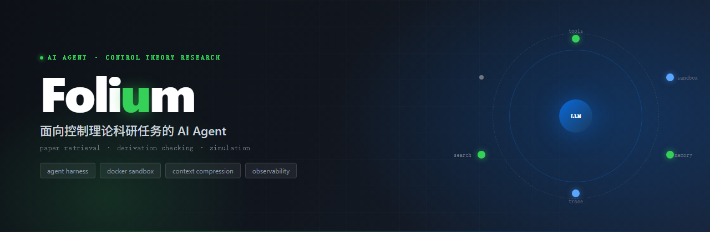
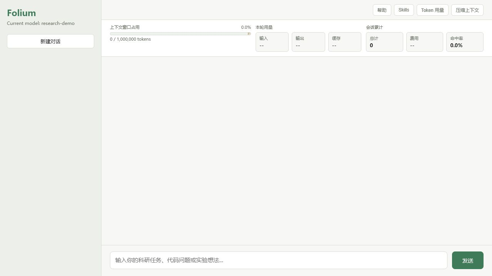

<p align="center">
  
</p>

<p align="center">
  <a href="https://github.com/PrisonBreakPB/Folium/actions"></a>
  <a href="https://www.python.org/"></a>
  
  <a href="LICENSE"></a>
  <a href="https://github.com/PrisonBreakPB/Folium/stargazers"></a>
  
</p>

---

> <p align="center">给科研工作者一个能读论文、查推导、跑实验、写论文的 AI 助手。你说什么，它做什么：</p>
> 
> - 「帮我调研 event-triggered control 的最新进展」→ 检索文献、读取 PDF、整理结构化笔记
> - 「写一段 PID 控制器的仿真代码并运行」→ 生成 Python 代码、沙箱里跑、返回结果和图表
> - 「把这些实验结果整理成论文的实验章节」→ 生成 LaTeX 源文件，公式、表格、引用齐全
> - 「检查这个 Lyapunov 推导有没有问题」→ 逐步核对假设和推导链路
> 
> 工具调用、模型推理、上下文压缩、文件变更全程记录，可复盘。

<details>
<summary>📑 目录</summary>

- [适用场景](#-适用场景)
- [快速开始](#-快速开始)
- [已实现能力](#-已实现能力)
- [Web 界面](#-web-界面)
- [工具系统](#-工具系统)
- [Skills](#-skills)
- [上下文压缩](#-上下文压缩)
- [本地可观测性](#-本地可观测性)
- [项目结构](#-项目结构)
- [科研智能体改造方向](#-科研智能体改造方向)
- [长期记忆](#-长期记忆)
- [后台记忆维护](#-后台记忆维护)
- [测试](#-测试)
- [写入与审批](#-写入与审批)
- [License](#-license)

</details>

Folium 正在从通用 Agent 演进为面向科研闭环的工作助手：帮助你检索与阅读论文、检查控制理论中的关键推导、生成并运行仿真实验，并沉淀可复盘的研究过程。项目同时建设**工具调用、Docker 沙箱、记忆和可观测性**等 Agent Harness 组件。



## 🎯 适用场景

Folium 覆盖科研工作的四个核心环节：

- **学术调研** — 检索论文、补全元数据、读取网页和 PDF 内容
- **理论研究** — 面向控制理论的公式、假设、Lyapunov 推导与 LMI 检查能力建设
- **实验验证** — 生成、执行和分析 Python 仿真实验
- **Agent 工程** — 工具参数校验、Docker 沙箱、上下文压缩、SQLite 持久化与 trace

> 学术检索、PDF 读取与工程 Harness 已具备基础能力；理论检查、结构化论文库和实验闭环仍在持续建设。

## 🚀 快速开始

```bash
git clone https://github.com/PrisonBreakPB/Folium.git
cd Folium
pip install -e .
```

在项目根目录创建 `.env`：

```bash
OPENAI_API_KEY=sk-...
OPENAI_BASE_URL=https://api.deepseek.com
FOLIUM_MODEL=deepseek-chat
```

启动 Web UI：

```bash
python -m folium
```

浏览器访问 <http://localhost:8000>。

<details>
<summary>完整安装、运行与环境配置</summary>

## 运行方式

安装为本地可编辑包：

```bash
pip install -e .
```

在项目根目录创建 `.env`，或在 shell 中设置环境变量：

```bash
OPENAI_API_KEY=sk-...
OPENAI_BASE_URL=https://api.deepseek.com
FOLIUM_MODEL=deepseek-chat
```

全局配置（可选）：在 `~/.folium/.env`（Windows 为 `C:\Users\PB\.folium\.env`）写一份
**全局默认配置**，无论从哪个目录启动 folium 都会读取它；在某个项目里再放 `.env` 可
覆盖全局默认值。优先级：已设的环境变量 > 项目 `.env` > 全局 `~/.folium/.env`。

```bash
# ~/.folium/.env
FOLIUM_API_KEY=sk-...
FOLIUM_BASE_URL=https://api.deepseek.com
FOLIUM_MODEL=deepseek-chat
```

启动 Web 界面：

```bash
python -m folium
```

默认访问：

```text
http://localhost:8000
```

启动 CLI：

```bash
folium --workspace D:\\Projects\\my-project
```

也可以先进入项目目录，再直接输入 `folium`；CLI 会自动把当前目录作为工作区。

CLI 与 Web 使用相同的会话、工具、审批和沙箱规则。CLI 默认使用 Docker + `bash` 模式：
文件工具直接操作当前工作区，Bash 在独立的空工作区中执行。Web 仍默认使用 `copy` 模式。
交互命令包括 `/new`、`/reset`、`/help`、
`/model`、`/mode`、`/skills`、`/status`（`/usage`）、`/workspace`、`/todos`、`/tokens`、
`/compact`、`/save`、`/sessions`、`/switch <id>`、`/delete <id>`、`/diff`、`/traces` 和
`/trace <id>`。CLI 中的受保护文件和可能修改工作区的 Bash 命令会在执行前显示审批提示；
模型调用的上下文压缩、用量、todo、预算和错误状态会实时显示。
文件修改 diff 使用红色背景标记删除行、绿色背景标记新增行。
输入 `/` 开头的命令时会实时显示匹配候选，可用方向键选择并按回车确认；已加载的 Skill 也支持补全。
输入 `/context` 可查看上下文窗口、输入/输出预算、本次及累计 Token、缓存命中率和预计价格。

CLI 默认使用 TypeScript + React/Ink 终端 UI。首次使用前构建前端：

```bash
npm --prefix cli-ui install
npm --prefix cli-ui run build
folium --workspace D:\\Projects\\my-project
```

Ink UI 只负责终端交互，Python Agent 仍负责模型调用、工具、沙箱、审批和会话。顶部会显示 Folium 叶片标识、标题、版本和当前项目名（窄终端会自动使用紧凑标识）。Ink UI 提供可滚动消息区、多行输入框、自动折行、输入历史、slash 命令补全、Markdown 消息渲染、结构化的用户/助手/工具消息、显示在消息区底部的 API 等待 Spinner、审批面板和包含 Model、Mode、Session、Workspace 的底部状态栏。输入达到终端宽度时会自动视觉折行；也可用 `Shift+Enter` 或 `Ctrl+J` 插入明确换行，普通回车提交。需要使用旧版 Python CLI 时，显式指定 `--ui python`。

## 配置

常用环境变量：

```text
OPENAI_API_KEY              模型 API key
OPENAI_BASE_URL             OpenAI 兼容 API 地址
FOLIUM_API_KEY              Folium 专用 API key，优先级高于 OPENAI_API_KEY
FOLIUM_BASE_URL             Folium 专用 base URL
FOLIUM_MODEL                默认模型（tier-balanced），默认 gpt-4o
FOLIUM_MODEL_FAST           快速/低成本模型（tier-fast，用于摘要、记忆维护等），默认 gpt-4o-mini
FOLIUM_MODEL_FLAGSHIP       旗舰模型（tier-flagship），默认同 FOLIUM_MODEL
FOLIUM_PROVIDER             openai 或 litellm
FOLIUM_API_FORMAT           API 格式：chat_completions（默认）或 responses
FOLIUM_MAX_TOKENS           单次输出 token 上限
FOLIUM_TEMPERATURE          采样温度
FOLIUM_MAX_CONTEXT          上下文 token 上限，默认 1000000
FOLIUM_TOKEN_ESTIMATOR      无真实 usage 时的 token 估算器：approx 或 deepseek，默认 approx
FOLIUM_DEEPSEEK_TOKENIZER   DeepSeek 官方 tokenizer 本地路径，仅在 deepseek 估算器下使用
FOLIUM_BASH_BACKEND         bash 工具执行后端：local 或 docker，默认 docker；如需本地执行可显式设为 local
FOLIUM_HOST_WORKSPACE       真实项目目录，默认当前进程工作目录
FOLIUM_SANDBOX_WORKSPACE_MODE 工作区模式：host、copy 或 bash；Web 默认 copy。copy 会在每个会话复制项目到 .folium/sandbox/sessions，文件改动不会自动回写真实项目；bash 只为 Bash 创建空工作区
FOLIUM_DOCKER_IMAGE         Docker 沙箱镜像，默认 python:3.11-slim
FOLIUM_DOCKER_NETWORK       Docker 沙箱网络模式，默认 bridge；如需禁止 bash 容器联网可设为 none
FOLIUM_DOCKER_CPUS          Docker 沙箱 CPU 限制，默认 1
FOLIUM_DOCKER_MEMORY        Docker 沙箱内存限制，默认 2g
BRAVE_SEARCH_API_KEY        Brave Search API key，用于 web_search 工具
FOLIUM_MEMORY_MAINTENANCE_TURNS               连续多少轮没有进行记忆维护后触发后台维护（默认 5）
FOLIUM_MEMORY_MAINTENANCE_MAX_STEPS           单次维护的模型/工具调用轮数上限（默认 5）
FOLIUM_MEMORY_MAINTENANCE_MAX_TOKENS          后台维护模型输出上限（默认 2000）
FOLIUM_LLM_TIMEOUT            OpenAI 客户端请求超时（秒），默认 30
FOLIUM_CIRCUIT_FAILURE_THRESHOLD  熔断器触发阈值（连续失败次数），默认 3
FOLIUM_CIRCUIT_COOLDOWN_SECONDS    熔断器冷却时长（秒），默认 10
FOLIUM_MAX_TOOL_RETRIES            工具失败自动重试次数上限（除首次外），默认 3
FOLIUM_BUDGET_USD        单次会话成本预算（美元）；0 或未设 = 不限（默认），设正数才生效
FOLIUM_BUDGET_SOFT_RATIO 软阈值（花到预算的比例后转用便宜模型），默认 0.8
```

### CLI 多端点 profile

CLI 可以把多套供应商凭据保存为全局环境变量或项目 `.env`，并在主端点失败时切换到独立的备用端点：

```text
FOLIUM_ACTIVE_PROFILE=deepseek
FOLIUM_FALLBACK_PROFILES=openai,backup

FOLIUM_PROFILE_DEEPSEEK_PROVIDER=openai
FOLIUM_PROFILE_DEEPSEEK_API_KEY=...
FOLIUM_PROFILE_DEEPSEEK_BASE_URL=https://api.deepseek.com
FOLIUM_PROFILE_DEEPSEEK_MODEL=deepseek-v4-pro

FOLIUM_PROFILE_OPENAI_PROVIDER=openai
FOLIUM_PROFILE_OPENAI_API_KEY=...
FOLIUM_PROFILE_OPENAI_BASE_URL=https://api.openai.com/v1
FOLIUM_PROFILE_OPENAI_MODEL=gpt-4o-mini
```

profile 名只能使用字母、数字和下划线。每套 profile 必须配置 `API_KEY` 和 `MODEL`；`PROVIDER` 默认为 `openai`，`BASE_URL` 可省略以使用 OpenAI 默认地址。未设置 `FOLIUM_ACTIVE_PROFILE` 时，CLI 保持原有 `OPENAI_API_KEY`、`OPENAI_BASE_URL`、`FOLIUM_MODEL` 配置方式。

主端点返回 `401/403` 时会直接尝试下一个 profile；对 `429`、5xx、超时和断连，会先执行现有重试与同端点模型降级，仍失败后再切换。其他 4xx 请求错误不会跨端点切换。切换后本会话继续使用成功的 profile；重启 CLI 后仍从 active profile 开始。

Responses 模式说明：设置 `FOLIUM_API_FORMAT=responses` 可切换到 OpenAI Responses API 格式（仅 `FOLIUM_PROVIDER=openai` 生效，LiteLLM 保持 Chat Completions）。DeepSeek 的 Responses 端点只支持 `deepseek-v4-flash` / `deepseek-v4-pro` 模型，为无状态接口、支持 function calling；切换时需同时把 `FOLIUM_MODEL` 换成上述模型之一。

模型路由（scene 规则路由 + 自动降级）：`folium/gateway.py` 提供按调用场景选择模型的规则路由。各调用方通过 `chat(..., scene="...")` 声明自己的场景，网关查 `scene → tier → 模型` 映射决定候选链（primary + fallback），并把 `route_reason`（为什么选它）写入观测。当 primary 模型调用遇到**可降级错误**（429 限流、5xx、超时/断连）时，`chat()` 会自动改用 fallback 候选重试，避免一失败就崩；参数/鉴权/上下文超限/安全拒答等请求侧错误不会换模型，直接抛出。每次降级都会记录 `llm_fallback` 事件（含原始错误与切到的模型）。当前内置场景：`agent_reasoning`（Agent 主循环，默认 tier-balanced）、`context_summarize`（上下文压缩，tier-fast）、`memory_maintain`（记忆维护，tier-fast）。换模型只改 tier 对应的 env，不改路由规则。

重试与熔断（`folium/llm.py` + `folium/circuit_breaker.py`）：每次请求显式设超时（`FOLIUM_LLM_TIMEOUT`，默认 30s），超时/断连/限流等瞬态错误在候选内做指数退避重试（429 若响应带 `Retry-After` 头则按该时长等待）。每个（provider, model）持有一个进程级熔断器（`folium/circuit_breaker.py`）：连续 `FOLIUM_CIRCUIT_FAILURE_THRESHOLD`（默认 3）次可降级错误后熔断打开，冷却 `FOLIUM_CIRCUIT_COOLDOWN_SECONDS`（默认 10s）内该模型被跳过、直接切下一个候选；冷却期过一次试探调用，成功即闭合复位。熔断状态记录为 `circuit_trip`（打开）与 `circuit_open`（命中已有熔断被跳过）事件。请求侧错误（参数/鉴权/上下文超限/安全拒答）不计入熔断。

成本预算（`folium/cost_meter.py` + `folium/agent.py`）：设置 `FOLIUM_BUDGET_USD`（美元，>0 生效）后，每次 LLM 调用按本地单价表估算成本累计到会话计费器。耗到预算的 `FOLIUM_BUDGET_SOFT_RATIO`（默认 0.8）后，Agent 自动把调用降级到 tier-fast 便宜模型（路由 `cheap_only` 分支）；耗到 100% 后 Agent 在下一轮硬停止本轮，并向用户返回预算用尽提示。预算进度在 WebUI 用量栏实时展示（软阈值黄色告警、耗尽红色）。会话 `reset()` 时重新计费，换对话即从零开始。

如果使用 Ollama 这类本地 OpenAI 兼容服务：

```bash
OPENAI_API_KEY=ollama
OPENAI_BASE_URL=http://localhost:11434/v1
FOLIUM_MODEL=qwen3:32b
```

</details>

## ✅ 已实现能力

- 💬 Web 对话界面：支持新建对话、切换历史对话、流式响应、工具调用展示和 todo 状态展示
- 🔌 OpenAI 兼容模型接入：通过 `OPENAI_API_KEY`、`OPENAI_BASE_URL`、`FOLIUM_MODEL` 配置模型
- 🔁 Agent 循环：模型可以多轮调用工具，再基于工具结果继续推理；多步骤任务会通过 todo 工具维护当前进度
- 🧰 工具系统：支持读文件、写文件、本地搜索、Web 搜索、网页读取、编辑、执行 shell 命令、子 Agent 和 todo 列表，执行前会统一校验工具参数，并对长时间无响应的工具调用做超时兜底
- 💾 本地持久化：会话、完整消息、trace 与 trace event 统一保存到 SQLite 数据库 `data/folium.db`
- 🗜️ 上下文压缩：三层渐进式压缩（截断工具输出、占位符压缩、LLM 摘要）
- 📊 Token 统计：实时显示上下文窗口占用、本轮用量、会话累计（含缓存命中率和费用）
- 🔍 本地可观测性：记录一次用户输入触发的 Agent 执行 trace、LLM 调用、工具调用和上下文压缩

## 🖥️ Web 界面

Web 入口提供：

- 🆕 新建对话
- 📜 历史对话列表
- 🔀 切换和删除历史对话
- ⚡ 流式输出
- 🏷️ 工具调用标签
- 📈 上下文窗口占用（真实 token，带百分比进度条）
- 💰 本轮用量（输入、输出、缓存、费用）
- 🧮 会话累计（总 token、费用、轮次柱状图）
- 🗂️ 历史统计（缓存命中、输出、总费用、缓存命中率）
- 🎛️ 常用命令按钮：帮助、Token 用量、压缩上下文

当前行为说明：

- 点击"新建对话"会进入一个空白对话状态
- 空白对话不会立刻持久化
- 发送第一条消息后，对话才会保存到 `data/folium.db`
- 切换到其他对话前，当前已有内容的对话会自动保存
- 每个会话同时保留完整历史和当前模型上下文：`messages.content` 保存原始内容，`messages.model_content` 只在内容被裁剪、压缩或注入 skill 后保存模型实际看到的版本；两者相同时只存一份。Web 历史展示使用完整历史，因此被裁剪的网页、PDF 或子 Agent 输出仍可恢复查看

## 🧰 工具系统

内置工具位于 `folium/tools/`：

```text
read_file       读取文件，支持 offset/limit
write_file      创建或覆盖文件（包括完整 LaTeX .tex 源文件）
edit_file       基于唯一字符串匹配的安全编辑（包括已有 LaTeX .tex 源文件），返回 diff
glob            按 glob 模式查找文件
grep            按正则搜索文件内容
bash            执行 shell 命令，支持 local/docker 后端、危险命令拦截、超时终止和输出截断
session_history 查询当前会话已持久化的完整历史；支持关键词搜索和按 message_id 分段读取
agent           启动子 Agent 处理独立子任务
todo            更新结构化任务列表，跟踪 pending / in_progress / completed
web_search      使用 Brave Search API 返回轻量 Web 搜索结果
web_fetch       读取单个 HTTP(S) URL，返回清洗后的 title 和正文片段
pdf_fetch       读取 PDF 正文文本
paper_search    通过 OpenAlex 搜索论文，返回结构化 JSON 证据
paper_validate  通过 OpenAlex 校验候选论文，标记 confirmed / partial / unverified / mismatch
```

`web_search` 是轻量搜索工具，只返回候选网页的 title、URL 和 snippet，不抓取全文、不做 RAG。需要设置 `BRAVE_SEARCH_API_KEY`；缺少 key 时工具会返回明确错误。

`web_fetch` 读取单个网页并返回清洗后的文本片段。它只允许 `http://` 和 `https://`，会拦截 localhost、内网地址、link-local 地址和重定向后的非公网地址；默认最多读取 2MB 响应体，最多返回 12000 字符，避免一次工具调用塞爆上下文。

`paper_search` 返回 OpenAlex 的结构化论文证据；`paper_validate` 用于最终输出前校验候选论文，未确认的文献应作为待核验线索，而不是已确认引用。

`todo` 工具用于长程、多步骤任务：

- Agent 会在系统提示词中要求多步骤任务使用 `todo`
- `todo` 每次接收完整列表替换当前状态，最多 20 项
- 状态只允许 `pending`、`in_progress`、`completed`
- 同一时间最多只能有一个 `in_progress`
- 如果连续 3 个工具调用轮次没有成功更新 todo，Agent 会向 messages 注入 `<reminder>Update your todos.</reminder>`
- Web 后端提供 `/todos`，并在 todo 更新时通过 SSE 发送 `todo_update`

<details>
<summary>🛠️ 工具开发细节：接口、调用流程与自动重试</summary>

工具接口保持简单：

```python
from folium.tools.base import Tool, ToolFailure, tool_failure

class HttpTool(Tool):
    name = "http"
    description = "请求一个 URL。"
    args_model = ...  # Pydantic 模型，自动生成 JSON Schema
    retry_safe = True  # 幂等/无副作用，失败时允许系统自动重试

    def execute(self, url: str) -> str | ToolFailure:
        import urllib.request
        try:
            return urllib.request.urlopen(url).read().decode()[:5000]
        except TimeoutError:
            return tool_failure("timeout", "timeout", "request timed out", retryable=True)
```

工具调用流程：

```text
模型输出工具调用
-> 根据工具名找到 Tool
-> 使用 Tool.validate_arguments() 按参数模型校验参数
-> 校验通过后调用 execute()
-> 校验失败时返回参数错误，不执行真实工具
-> 工具执行失败时返回 ToolFailure，由 Agent 读取结构化错误字段
-> 对 retryable=True 且工具声明 retry_safe 的失败，Agent 做指数退避自动重试（上限 max_tool_retries，默认 3），达上限后回投最终失败结果
```

工具成功结果可以是字符串或 `ToolOutput`；执行失败应返回 `ToolFailure`，其中包含 `code`、`category`、`message` 和可选的 `retryable`、`details`。Agent 不会因为成功正文中出现 `Error` 等词而误判失败；旧版字符串错误仍仅作为兼容路径处理。

**自动重试规则**：仅当 `retryable == True` 且工具声明 `retry_safe = True` 时，Agent 才对该失败做系统级自动重试（指数退避 + 抖动，默认最多重试 `FOLIUM_MAX_TOOL_RETRIES` 次，默认 3）。`retry_safe` 默认 `True`，适合幂等、无副作用的读/查询/外部网络工具；写文件、编辑、执行 shell、子 Agent 等有副作用或非幂等的工具应显式设为 `False`，避免重复执行造成二次副作用。自动重试的中间失败不会写入对话历史，也只以最终状态计入失败连击计数。重试次数通过工具结果的 `attempts` 字段与观测记录透出。

如果连续 5 次工具参数校验失败，Agent 会停止当前任务并返回：

```text
Consecutive 5 tool call failures, current task stopped.
```

新增工具时需要：

- 继承 `folium.tools.base.Tool`
- 声明 `name`、`description`、`parameters`
- 在 `parameters` 中使用 JSON Schema object 描述参数，并写清 `required`
- 实现 `execute`
- 注册到 `folium/tools/__init__.py` 的 `ALL_TOOLS`
- 补充 schema/参数校验测试，有副作用的工具还要覆盖主要成功和失败路径

</details>

## 🧩 Skills

Folium 支持轻量级 skill。Skill 位于项目根目录的 `skills/`，每个 skill 使用一个目录和一个 `SKILL.md`：

```text
skills/
└── your-skill-name/SKILL.md
```

启动时 Agent 会扫描 `skills/*/SKILL.md`，只把 skill 的名称、描述和文件路径加入系统提示词。完整 `SKILL.md` 不会预先塞进上下文；模型在判断任务匹配某个 skill 时，会先用 `read_file` 读取对应文件，再按其中的工作流执行。

用户也可以在输入框使用 `/skill-name` 前缀直接激活某个 skill，例如 `/literature-review 帮我找关于 Transformer 的论文`，系统会自动注入该 skill 的完整内容。

`SKILL.md` 需要包含简单 frontmatter：

```markdown
---
name: your-skill-name
description: Use when the user asks for this specialized workflow.
---

# Your Skill Name

...
```

## 🗜️ 上下文压缩

<details>
<summary>🗜️ 上下文压缩机制详解</summary>

Folium 采用预处理层加三级渐进式上下文压缩策略，自动触发时优先使用 LLM API 返回的 usage，并对新增内容使用本地估算：

| 层级 | 触发阈值 | 操作 | 成本 |
|------|---------|------|------|
| 预处理层 | 50% | 折叠完全相同且不少于 200 字符的 tool 输出：保留最新完整结果，将较早重复结果替换为占位符；豁免工具跳过 | 零 LLM 调用 |
| Layer 1 | 60% / 70% | 截断长 tool 输出（primary 工具 60%，secondary 工具 70%，保留首尾各 1536 字符） | 零 LLM 调用 |
| Layer 2 | 80% | 将已截断的 primary/default tool 输出替换为占位符 | 零 LLM 调用 |
| Layer 3 | 90% | 增量更新历史摘要，并按预算保护最近用户原文 | 调 LLM，失败时本地兜底 |

触发时机：
- 用户消息加入后（`after_user_message`）
- 工具结果加入后（`after_tool_results`）

Token 计算：
- 自动触发时优先使用最近一次 LLM API 返回的真实 `prompt_tokens` 和 `completion_tokens`
- 新加入的消息（用户输入或工具结果）、压缩后的 `after_tokens`、首次调用前以及手动 `/compact` 使用本地估算器
- 默认估算器为 `approx`（`len(text) // 3`，不依赖 transformers/numpy）。如需更精确的 DeepSeek tokenizer 估算，可设置 `FOLIUM_TOKEN_ESTIMATOR=deepseek` 并配置 `FOLIUM_DEEPSEEK_TOKENIZER`（会惰性加载 transformers，加载失败时自动回退到 `approx`）
- 压缩水位按输入预算判断：`输入预算 = FOLIUM_MAX_CONTEXT - 20000`，默认给模型输出预留 20000 tokens 缓冲
- 压缩后不再保留 recent tail；系统会从真实用户消息中倒序保护最近原文，默认预算 20000 tokens。若最近一条用户消息本身超过预算，也会整条保留。该预算使用同一个本地 token 估算器：优先 tokenizer，失败再回退 `len(text) // 3`
- 预处理层会先对超过 50% 输入预算时出现的重复 tool 输出做精确去重，再进入后续可能有损的截断、占位符压缩和摘要流程；仅字符串内容、长度不少于 200 字符且不属于豁免工具的结果参与去重
- `bash`、`grep`、`glob` 等 primary 工具在 60% 后可裁剪；`read_file`、`agent` 等 secondary 工具在 70% 后可裁剪，但 80% 的占位符压缩会跳过 secondary 工具
- Layer 1 会跳过最近 2 个工具调用轮次的 tool 输出，避免刚读到的文件、实验结果或子 Agent 结论立刻被裁剪
- 上下文压缩只作用于发送给模型的 `messages`；用于 Web 历史和持久化复盘的 `transcript` 保留原始 user / assistant / tool 消息，因此完整工具输出不会因去重或其他压缩层丢失

费用计算：
- 支持缓存 token 单独计费（`prompt_cache_hit_tokens`）
- 费用公式：`(prompt - cached) × 输入价 + cached × 缓存价 + completion × 输出价`

</details>

## 🔍 本地可观测性

Folium 将会话与可观测性数据统一保存到本地 SQLite。一次用户输入会生成一个 trace；一次 LLM 调用、工具调用、Agent round、上下文压缩会生成对应 span 或 event。

默认保存位置：

```text
data/folium.db
```

数据库包含四张业务表：

- `sessions`：会话 ID、模型、system prompt、创建时间和更新时间
- `messages`：完整对话历史、模型实际使用的压缩上下文，以及工具调用关联信息
- `traces`：每次 Agent 执行的摘要，如会话、轮次、状态和耗时
- `trace_events`：trace 内的细粒度事件、span、快照、工具元数据和错误信息

其中 `messages` 保存会话内容，`traces` / `trace_events` 保存执行过程；两者用途不同，不会重复保存一份完整工具输出。工具输出的完整原文保存在 `messages.content`，trace 默认只保存脱敏后的预览、长度和 hash。

当前 trace 事件包括：

- `user_task`：一次用户输入触发的完整 Agent 执行
- `agent_round`：每轮 Agent 循环
- `llm`：模型调用、消息数量、工具数量、token、首 token 时间、输出摘要
- `llm_error`：模型调用失败时的 provider、状态码、错误类型、错误码和 request id
- `tool`：工具名称、参数、结果摘要、耗时、错误状态
- `sandbox_event`：Docker 工作区模式、容器启动、命令结束、超时和清理等生命周期事件
- `todo_update` / `todo_reminder`：todo 状态更新和自动提醒注入
- `context_compression`：上下文压缩前后的 token、消息数量和实际执行的压缩层
- `llm_request_snapshot` / `llm_response_snapshot`：每次模型调用实际输入和模型响应快照
- `context_snapshot`：上下文压缩前后的 `messages` 快照
- `agent_result`：最终回复摘要、消息数量和上下文 token 估算

<details>
<summary>🔍 可观测性配置与查看方式</summary>

可观测性配置：

```text
FOLIUM_OBSERVABILITY=1
FOLIUM_DB_PATH=data/folium.db
FOLIUM_TRACE_FULL_USER_INPUT=1
FOLIUM_TRACE_FULL_LLM_INPUT=0
FOLIUM_TRACE_FULL_LLM_OUTPUT=0
FOLIUM_TRACE_FULL_CONTEXT_SNAPSHOTS=0
FOLIUM_TRACE_FULL_TOOL_ARGS=1
FOLIUM_TRACE_FULL_TOOL_OUTPUT=0
FOLIUM_TRACE_REDACT_SECRETS=1
FOLIUM_TRACE_MAX_PREVIEW_CHARS=1000
```

默认 trace 只保存快照 preview、长度和 hash；打开 `FOLIUM_TRACE_FULL_LLM_INPUT`、`FOLIUM_TRACE_FULL_LLM_OUTPUT` 或 `FOLIUM_TRACE_FULL_CONTEXT_SNAPSHOTS` 后，会把对应完整内容写入 `trace_events`，适合调试但会显著增加数据库体积。

查看 trace：

```text
/traces
/trace <trace_id>
```

</details>

## 📁 项目结构

```text
folium/
├── __main__.py              Web 入口
├── agent.py                 Agent 主循环、工具调用和观测插桩
├── llm.py                   OpenAI 兼容 LLM 客户端和 LiteLLM 后端
├── context.py               上下文估算与压缩
├── session.py               会话保存、读取、切换和删除
├── config.py                环境变量配置
├── prompt.py                系统提示词组装（读取 prompts/ 模块）
├── prompts/
│   ├── 01-soul.md           人设（原 role.md 演进而来，可自定义）
│   ├── 02-rules.md          行为规则（分组散文）
│   ├── 03-parallel-tools.md 多工具并行纪律
│   ├── 04-scratchpad.md     独立临时工作目录
│   ├── 05-skills.md         技能库模板
│   ├── 06-memory.md         长期记忆模板
│   └── 07-environment.md    环境元数据模板
├── observability/           本地 trace、span、脱敏和摘要读取
├── tools/                   内置工具
└── web/
    ├── server.py            FastAPI + SSE 后端
    └── static/index.html    Web 前端
```

## 🔬 科研智能体改造方向

后续计划围绕科研工作流和 Harness 组件继续扩展：

- 文献综述与研究方向发现
- 数学推导与公式验证
- 仿真实验代码生成与运行
- TeX 论文写作
- Agentic RAG 和证据链追踪
- 沙箱执行与文件影响追踪
- Artifact 记录，如报告、TeX、代码、图表、实验日志
- 评估与反馈机制
- Langfuse、Phoenix 或 OpenTelemetry 等外部观测集成

## 🧠 长期记忆

长期记忆以分门别类的 Markdown 文件形式存储在当前项目 git 根目录对应的 `~/.folium/projects/<slug>/` 下：`user.md`（用户画像与协作偏好）、`feedback.md`（方法论纠偏与确认有效的工作方式）和 `project.md`（项目背景、决策与待办事项）。git 根目录通过逐级向上查找 `.git` 目录确定；slug 会对该路径做清洗，只保留字母数字（超过 200 字符时改用哈希），这样同一项目的不同 checkout 共享一份记忆位置，而相邻的兄弟仓库彼此隔离。

主 Agent 通过普通的 `read_file` / `write_file` / `edit_file` 工具访问记忆：系统提示词会把这三个文件作为背景上下文注入，规则 15 要求它只为持久性事实更新这些文件。原来的 `memory` 工具已被移除。

## 🧹 后台记忆维护

在主 Agent 连续若干个完成轮次（`FOLIUM_MEMORY_MAINTENANCE_TURNS`，默认 5）没有写入本项目记忆目录后，会运行一次保守的后台维护。它会收到已完成的主 Agent 消息副本和相同的可见工具 schema，并附加一条最终的英文记忆维护用户提示。整个过程最多 5 轮模型/工具调用，输出预算 2000 tokens；允许使用的工具为自由使用 `read_file`、`grep`、`glob`，外加被钳制到项目记忆目录内的 `write_file` / `edit_file` —— 其他任何工具调用都会被无副作用地拒绝，任何写到记忆目录之外的请求都会被拒绝。

对同一个项目，主 Agent 与后台 Agent 互斥：如果主 Agent 在当前轮次已经写入过本项目的记忆目录（通过扫描其工具调用中指向这些路径的 `write_file` / `edit_file` 检测），后台维护会被跳过并清空检查点。后台维护可以选择 `NO_CHANGE`（不做任何变更）。当复制的请求加上输出预算会超过模型上下文上限时，它会直接跳过而不是截断上下文，并把该次视为已检查。看门狗会放弃超过墙钟时限仍挂起的维护，让后续轮次可以重试而不是一直卡死。它的 trace 会记录复制的上下文来源、消息数与可见工具数、估算输入 token、被拒绝的工具调用、最终状态和缓存命中 token，但不记录记忆内容本身。

## 🧪 测试

当前可用的 unittest：

```bash
python -m unittest tests.test_tool_validation tests.test_tool_encoding tests.test_observability tests.test_web_server tests.test_session
```

如果安装了 pytest，也可以运行：

```bash
pytest
```

## 🛡️ 写入与审批

Web UI 中，`write_file` 和 `edit_file` 修改 `.tex`、`.bib`、`.sty`、`.py`、`.m`、`.ipynb`、`.sh` 时，会先聚合同一轮的受保护文件变更并展示 diff。用户可以确认应用全部变更、要求修改或拒绝并结束：要求修改不会写入文件，反馈会作为工具结果交给 Agent 生成新的变更，并再次等待审批；拒绝后当前 Agent 任务会停止，不会自动重试。同一批次在拒绝或要求修改后，其他尚未执行的工具调用会被跳过。审批面板支持在多个文件之间切换，并可按需分段加载完整 diff；应用前会再次校验文件基线，避免覆盖审批期间的外部修改。非受保护文件仍直接执行并返回 diff。看起来会写入挂载工作区的 `bash` 命令仍会在执行前展示命令预览并等待用户审批；审批不会自动超时。`general` 子 Agent 会继承同一审批规则。

## 📄 License

MIT。基于 [CoreCoder](https://github.com/he-yufeng/CoreCoder) 二开，原作者何宇峰。
